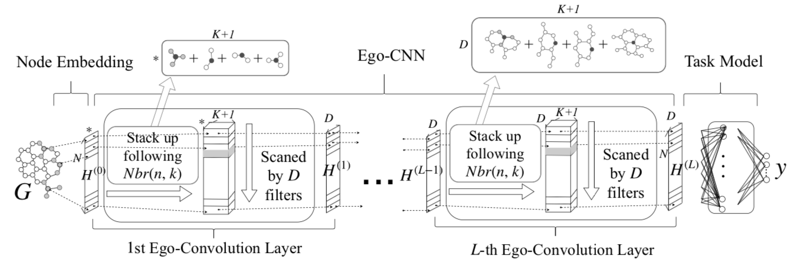

# Ego-CNN
This is the repo for "Distributed, Egocentric Representations of Graphs for Detecting Critical Structures", Ruo-Chun Tzeng, Shan-Hung Wu, In Proceedings of ICML 2019.
 * [slides](https://drive.google.com/open?id=1ypDgm_EVsJCjC0c5Rl7dBvzQSRjSbkXZ)

In the paper, we proposed **Ego-Convolution** layer, which keeps the nice properties of Convolution layer to the graph including:
 * detection of location-invariant patterns
 * enlarged receptive fields in multi-layer architecture
 * [most importantly] detection of **precise** patterns

This enables our Ego-CNN to provide explanation to its prediction when jointly learned with a task.

 1. In effect, Ego-CNN with L layers can detect patterns up-to L-hop ego-networks.
 2. By using the existing CNN visualization techniques such as Transposed Convolution or Grad-CAM variants, we can visualize the detected patterns in a specific filter or a specific neuron.
 3. By tying the weight of filter across different layers, our Ego-CNN is regularized to detect **self-similar** patterns

## Dependence
 * Python >= 3.6
 * Tensorflow >= 1.0
 * NetworkX 2.0
 * Numpy >= 1.13, Matplotlib >= 2.1
 * Optparse

## To Reproduce Our Result On ICML'19

### Step 1. Download and Preprocess Graph Classification Datasets
Execute Command `python download_dataset.py` to download all the bioinformatic and social network datasets used in the paper.

## Step 2. Train Ego-CNN on specified datasets for specified tasks
To reproduce ...
 * Graph Classification Experiments: run `./execute-graph-classification-on-benchmarks.sh`
 * Effectiveness of Scale-Free Regularizer: run `./execute-graph-classification-on-benchmarks.sh`
 * Visualization on synthetic compounds: run `./execute-graph-classification-on-benchmarks.sh`
