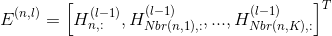
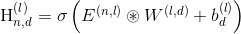
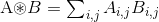

# Ego-CNN
This is the repo for "Distributed, Egocentric Representations of Graphs for Detecting Critical Structures", Ruo-Chun Tzeng, Shan-Hung Wu, In Proceedings of ICML 2019.
 * [paper link](http://proceedings.mlr.press/v97/tzeng19a.html), [slides](https://drive.google.com/open?id=1ypDgm_EVsJCjC0c5Rl7dBvzQSRjSbkXZ)

In the paper, we proposed Ego-Convolution layer, which is a generalization of traditional Convolutional layer to graph, aiming to detect precise graph patterns up to global-scale in an efficient manner.

Ego-Convolution consists of 2 steps:

(1) neighboring embedding collecting step, which constructs for each node , and

(2) filter scanning step, which generates the output embedding for each node by , where .

In effect, Ego-CNN with  Ego-Convolution layers can detect -hop egonets.

## Dependence
 * Python >= 3.6
 * Tensorflow >= 1.0
 * NetworkX 2.0
 * Numpy >= 1.13, Matplotlib >= 2.1
 * Optparse

## To Reproduce Our Result On ICML'19

### Step 1. Download and Preprocess Graph Classification Datasets
Execute Command `python download_dataset.py` to download all the bioinformatic and social network datasets used in the paper.

## Step 2. Train Ego-CNN on specified datasets for specified tasks
To reproduce ...
 * Graph Classification Experiments: run `./execute-graph-classification-on-benchmarks.sh`
 * Effectiveness of Scale-Free Regularizer: run `./execute-graph-classification-on-benchmarks.sh`
 * Visualization on synthetic compounds: run `./execute-graph-classification-on-benchmarks.sh`

## Details
Each experiment contains (1) preprocess step, (2) training step and optionally (3) visualization step.
 1. Each graph dataset needs to be preporcessed by `python preprocess-dataset.py -n [dataset-name] -k [size of neighborhood] [-s relabel graph or not]`, where we already filled the required parameters in the `*.sh` scripts.
 However, please note that there are still many options in processing the dataset such as
     * How to assign global ordering of nodes?
     * How K-Nearest Neighbors are chosen for each node?

 ... etc. For the details, please see the comments in [preprocess-dataset.py](preprocess-dataset.py).
 As our main focus is at detecting critical structures, We just choosed an okay setting to get comparable performance.

 2. Execute `python run-ego-cnn.py -n [dataset-name] -g [gpu-id] -f [gpu-fraction] -k [#neighbor of Ego-Convolution] -m [model-type]` with the below settings for each task:
  * Graph Classification Experiments are all with `k=17` (self + 16 nearest neighbors) and `model-type='6L'` (means 1 Patchy-San + 5 Ego-Convolution Layers)
  * Scale-Free Experiments use `model-type='6L_SF` (with scale-free regularizer) and `model-type='2L'` (base model)
  * Visualization Experiments of synthetic compound datasets: `k=4` and `model-type='6L'`

 3. The trained Ego-CNN can be visualized by many existing CNN techniques. Below are some examples:
   * Attention Layer + Transposed Convolution: run `python plot-critical-structure-Attention.py -n [dataset-name] -g [gpu-id] -f [gpu-fraction] -k [#neighbor of Ego-Convolution] -t [threshold to select important neighborhoods]`. This is the setting to plot the figures in our paper.
   * Grad-CAM[ICCV'17] + Transposed Convolution: run `python plot-critical-structure-GradCAM.py -n [dataset-name] -g [gpu-id] -f [gpu-fraction] -k [#neighbor of Ego-Convolution] -t [threshold to select important neighborhoods]`.
